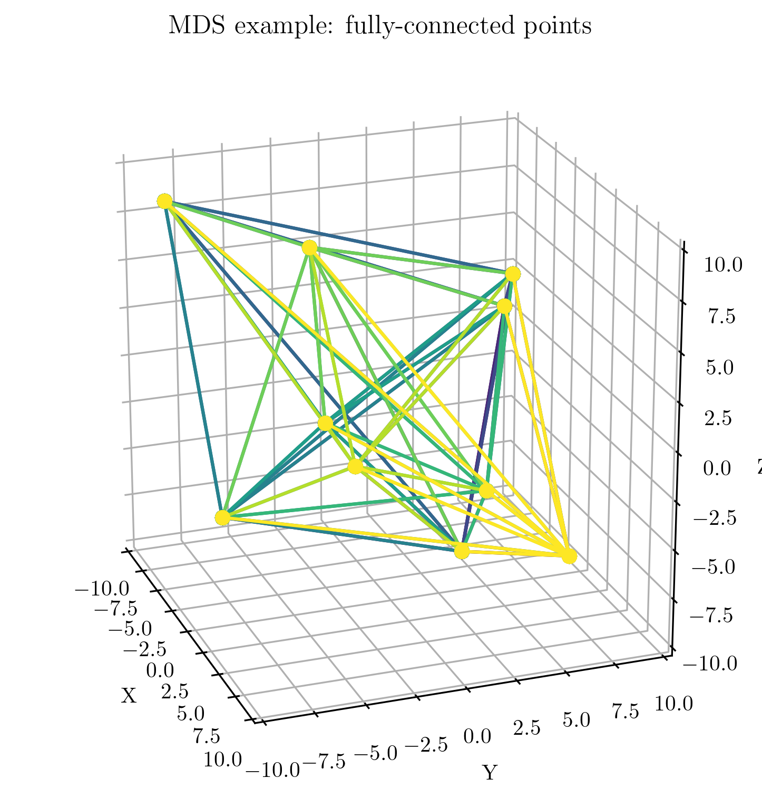
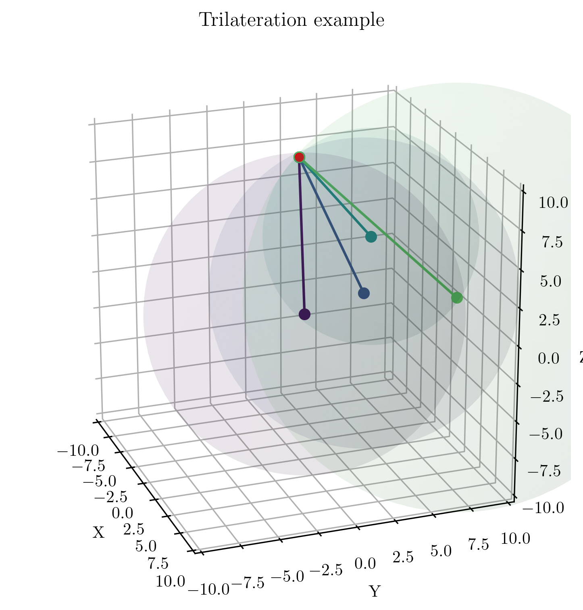
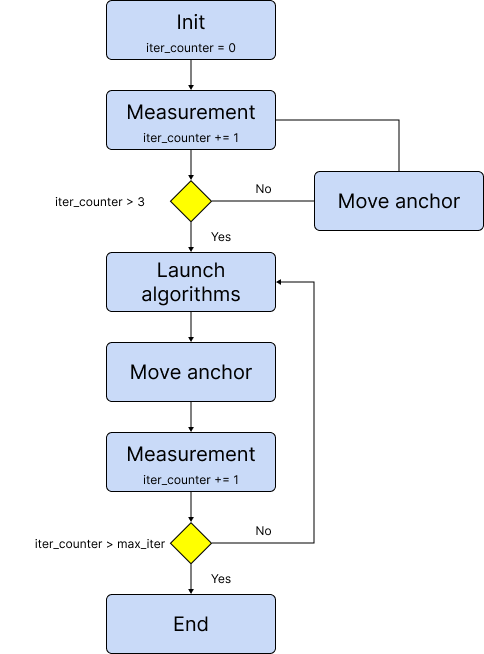
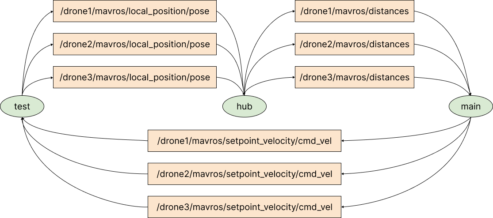
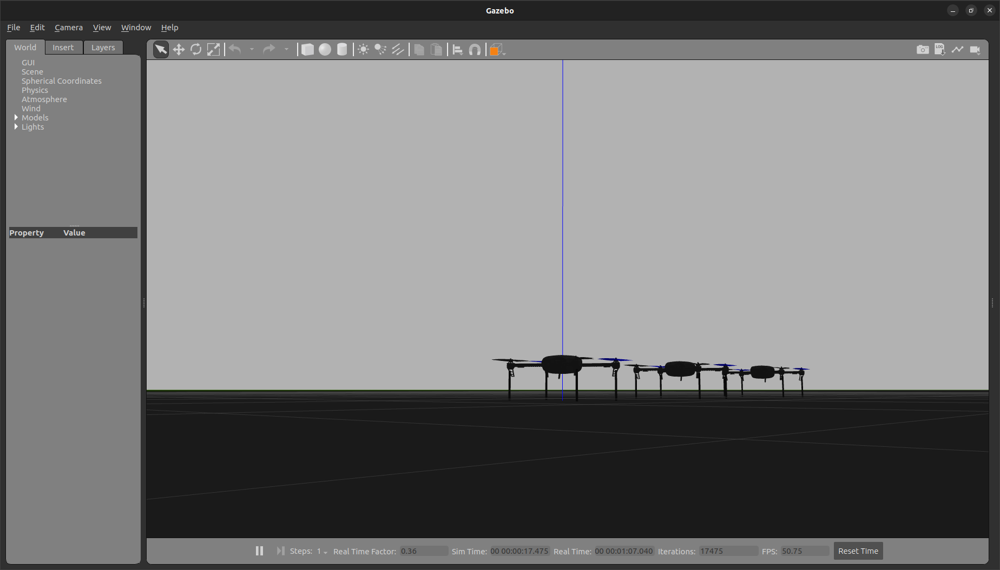

# Infrastructure-free Multidimensional Scaling (MDS) for drones swarm localization

The project aims to estimate the location of a fleet of drones via Multi-Dimensional Scaling (MDS) algorithm.

The performances are compared with standard trilateration algorithm, solved via numerical approach (Least Square Minimization - LSM)

The project has been developed as ROS2 package (distribution: Humble), mainly developed in Python3.

Authors:
@[muttigiacomo](https://github.com/muttigiacomo)
@[oselin](https://github.com/oselin),
@[riccardoperiotto](https://github.com/riccardoperiotto)

The theoretical explanation and analysis can be found in [report](./report.pdf)

 

## Structure of the software
After a first initialization, the measurement procedure starts and the motion of the anchor follows. Since both the algorithms require at least 4 measurements, an initial loop verifies that 4 measurements are taken before launching the algorithm.

Once achieved that, both the algorithms are launched a measurement-motion cycle occurs, while the swarm of drones moves at constant velocity in space.

The logical structure of the code can be observed in the following figure.

    

## Numerical simulation
A numerical simulation was run to collect data and further estimate some metrics for performance analysis.

The collected data is stored in `./data_analysis` folder, as well as some Python and Jupyter Notebook scripts to compute both graphs and results.

The numerical simulation runs thanks to three main scripts, called `test.py`, `hub.py` and `main.py`.

The scripts are automatically started if the launch procedure (see next sections) is followed.

The software replicates the Software-in-the-loop (SITL) approach, by relying on a ArduPilot+Mavros emulation. The used topics can be seen in the following picture.

    

## Gazebo simulation
Additionally, a proper SITL is achieved by introducing the combined usage of
- __Gazebo__: to simulate the physics
- __ArduPilot__: to introduce MavLink commands
- __Mavros__: to allow MavLink-ROS2 communication

The SILT is computationally heavy and require high-performance hardware. Please do use it with few drones, even though it can support unlimited ones.

In the following picture, the Gazebo environment along with the used drones can be observed

    

## Build and install the project

__DISCLAMER__: the project was developed on Ubuntu 22.04 and ROS2 Humble, updated on August 2023. The authors are not responsible for possible upgrades of either the OS or the tools used. Please verify yourself possible issues

__WARNING__: ROS2 is a very complex software and has compatibility problems with new OS versions

In order to install the software and make it work, few steps are needed.

1) Download this repository. You can save it in any folder, but `$HOME` is preferred.
    ~~~bash
    cd ~
    git clone git@github.com:oselin/drone-pose-estimation.git
    ~~~

2) If ROS2 Humble is not installed, please install it by running
    ~~~bash
    cd ~/drone-pose-estimation
    chmod +x install/install_ros2_humble.sh
    ./install/install_ros2_humble.sh
    ~~~

3) Install all the tools and requirements needed for running the project, by running
    ~~~bash
    cd ~/drone-pose-estimation
    chmod +x install/install_tools.sh
    ./install/install_tools.sh
    ~~~

## Run the project

To run the simulation using Gazebo, i.e. software-in-the-loop (SITL), please run
~~~bash
cd ~/drone-pose-estimation
chmod +x launch/launch_gazebo # only the first time, to provide permissions
./launch/launch_gazebo TYPE_NUMBER_OF_DESIRED_DRONES
~~~

An example can be
~~~bash
./launch/launch_gazebo 3
~~~

To run the simulation using the dynamic (numerical) model, please run
~~~bash
cd ~/drone-pose-estimation
chmod +x launch/launch_gazebo # only the first time, to provide permissions
./launch/launch_test TYPE_NUMBER_OF_DESIRED_DRONES
~~~

An example can be
~~~bash
./launch/launch_test 20
~~~